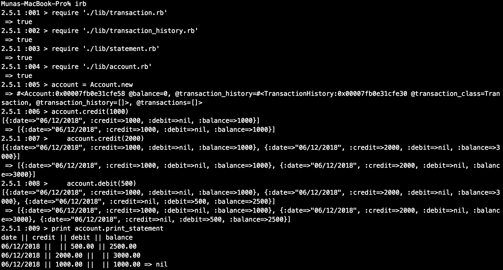

[](https://travis-ci.org/MHUS25/bank-tech-test)

# Bank tech test

## Specification

### Requirements

* You should be able to interact with your code via a REPL like IRB or the JavaScript console.  (You don't need to implement a command line interface that takes input from STDIN.)
* Deposits, withdrawal.
* Account statement (date, amount, balance) printing.
* Data can be kept in memory (it doesn't need to be stored to a database or anything).

### Acceptance criteria

**Given** a client makes a deposit of 1000 on 10-01-2012  
**And** a deposit of 2000 on 13-01-2012  
**And** a withdrawal of 500 on 14-01-2012  
**When** she prints her bank statement  
**Then** she would see

```
date || credit || debit || balance
14/01/2012 || || 500.00 || 2500.00
13/01/2012 || 2000.00 || || 3000.00
10/01/2012 || 1000.00 || || 1000.00
```

## Getting started

### To set up the project

1. clone repo to your local machine `git clone https://github.com/MHUS25/bank-tech-test.git`
2. Run the command `gem install bundle` (if you don't have bundle already)
3. When the installation completes, `run bundle`

## Usage

Run the program from the command line e.g.

`require './lib/statement.rb'`

To create an account:
`account = Account.new`

To deposit:
`account.credit(1000)`

To withdraw:
`account.debit(500)`

To print your statement:
`print account.print_statement`


## Running tests

To run tests `rspec`

## My Approach

Two classes: Account (responsible for making and recording transactions) and Statement (responsible for printing statements).

## Screenshots


